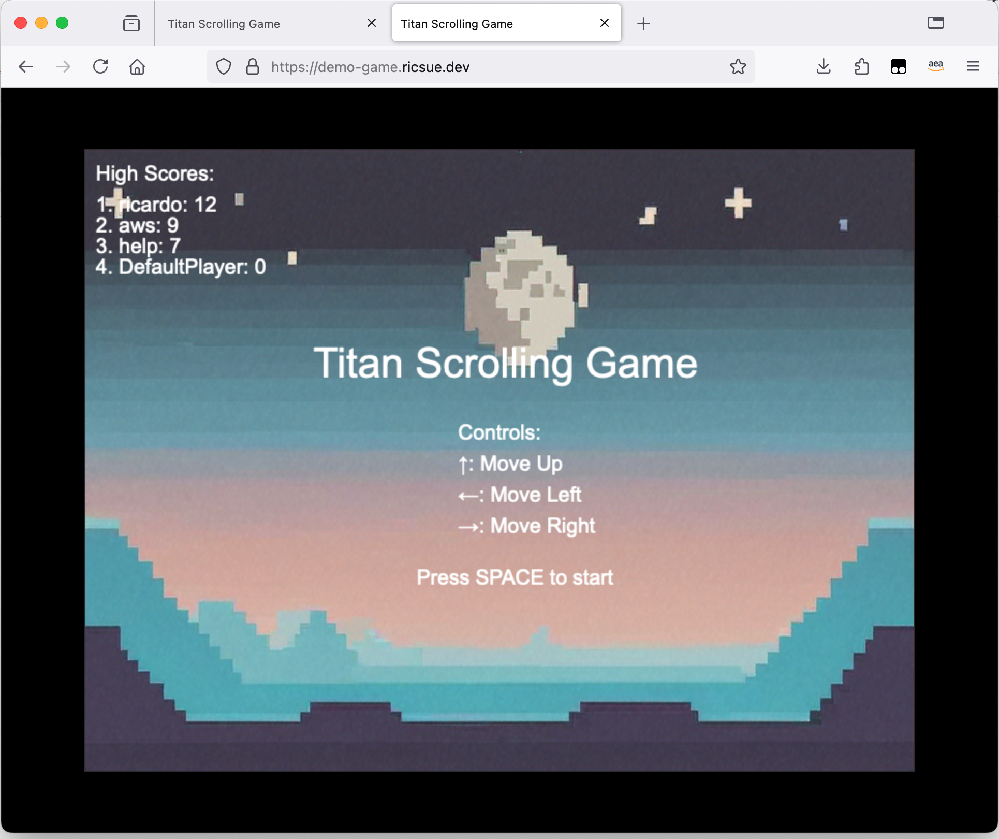

# Titan Scroller

This is a very simple sideways scrolling game that I put together with the help of my trusty AI coding companion, Amazon Q Developer. I am NOT a Javascript developer, but that didn't stop me creating this.



If you want to run this locally, then you need

* NodeJS and npm (I was using v20.10) but I am not doing anything weird so it should work on other versions

You will then need to do the following:

1/ Start a local Valkey container image - I have provided a docker-compose file you can use in the valkey directory which I use. I am using Finch, and I start this container with the following command:

```
finch compose -p local-valkey -f valkey.yml up
```

and shut it down with

```
finch compose -p local-valkey -f valkey.yml down
```

Valkey should now be listening on port 6379. If you have the valkey-cli you can use this to check, otherwise you should just see something like this on the terminal:

```
INFO[0030] Creating container valkey                    
INFO[0030] Attaching to logs                            
valkey |1:C 23 Oct 2024 21:18:12.098 # WARNING Memory overcommit must be enabled! Without it, a background save or replication may fail under low memory condition. Being disabled, it can also cause failures without low memory condition, see https://github.com/jemalloc/jemalloc/issues/1328. To fix this issue add 'vm.overcommit_memory = 1' to /etc/sysctl.conf and then reboot or run the command 'sysctl vm.overcommit_memory=1' for this to take effect.
valkey |1:C 23 Oct 2024 21:18:12.100 * oO0OoO0OoO0Oo Valkey is starting oO0OoO0OoO0Oo
valkey |1:C 23 Oct 2024 21:18:12.100 * Valkey version=7.2.5, bits=64, commit=00000000, modified=0, pid=1, just started
valkey |1:C 23 Oct 2024 21:18:12.100 * Configuration loaded
valkey |1:M 23 Oct 2024 21:18:12.100 * monotonic clock: POSIX clock_gettime
valkey |1:M 23 Oct 2024 21:18:12.100 * Running mode=standalone, port=6379.
valkey |1:M 23 Oct 2024 21:18:12.101 * Server initialized
valkey |1:M 23 Oct 2024 21:18:12.101 * Ready to accept connections tcp
```

2/ Once that is running, start the backend. This connects with the Valkey container and you will need to set up an environment variable before you do this.

```
export VALKEY_TLS=false
export CORS_ORIGIN="*"
VALKEY_SERVER=127.0.0.1:6379
node app.js
```

Which if successful you should see something like:

```
CORS Origin configured as: http://127.0.0.1:3000
Server running on port 3001
AWS Region: eu-west-1
Secret Key: leaderboard-reset
CORS Origin: http://127.0.0.1:3000
(node:41578) NOTE: The AWS SDK for JavaScript (v2) is in maintenance mode.
 SDK releases are limited to address critical bug fixes and security issues only.
```

> **Yeah I know!** I should have used the latest AWS SDK for Javascript. On the backlog!

The local backend (API) server will be listening out on 127.0.0.1:3001. With that running, now the next step.

3/ From the game directory, edit the config.js to make sure that it is pointing to the local API (127.0.0.1:3001) and then start the game by typing:

```
node server.js
```
which if working, should display

```
Titan Scrolling Game server listening at http://localhost:3000
```

4/ Open a browser at http://127.0.0.1:3000 and if the angels are with you, you can now enjoy the game!